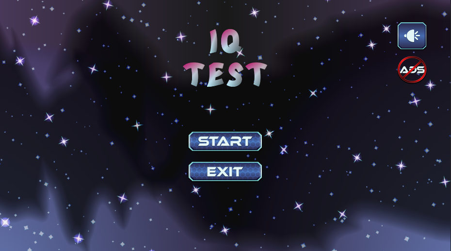
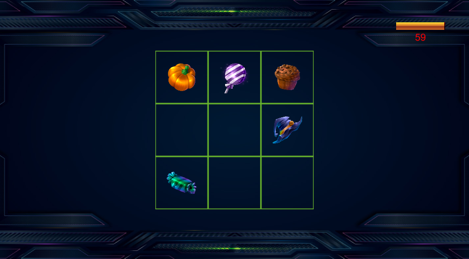
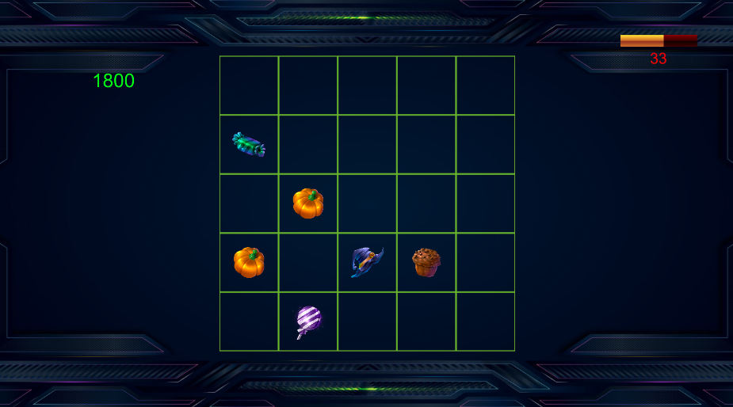
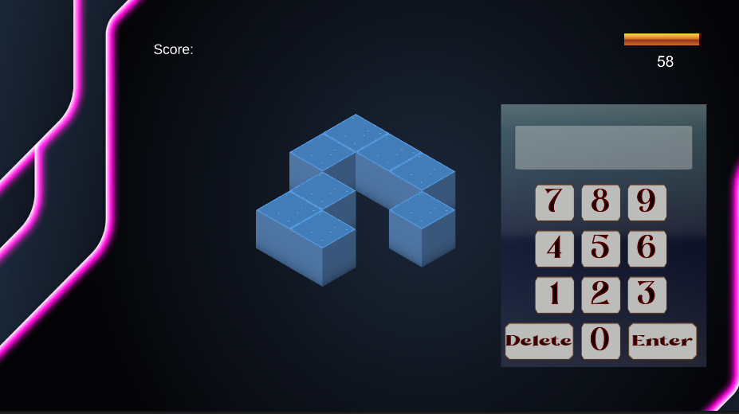
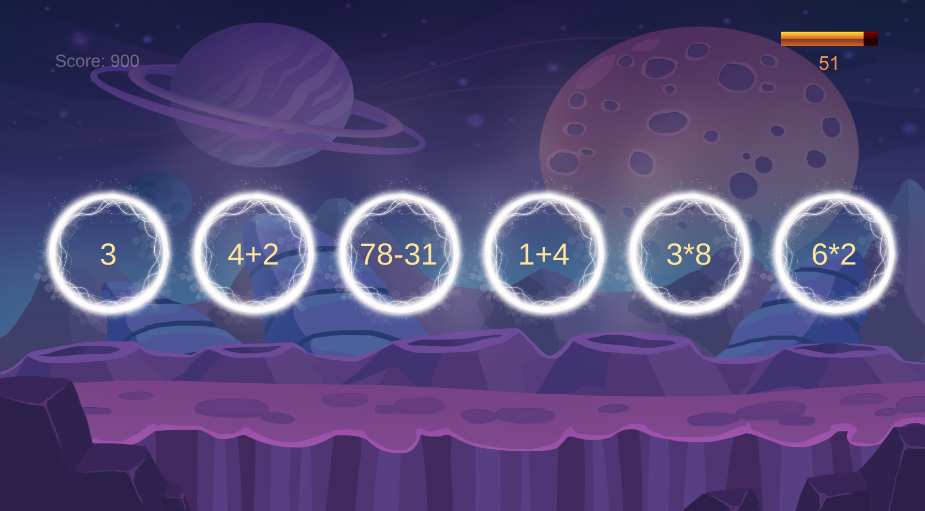
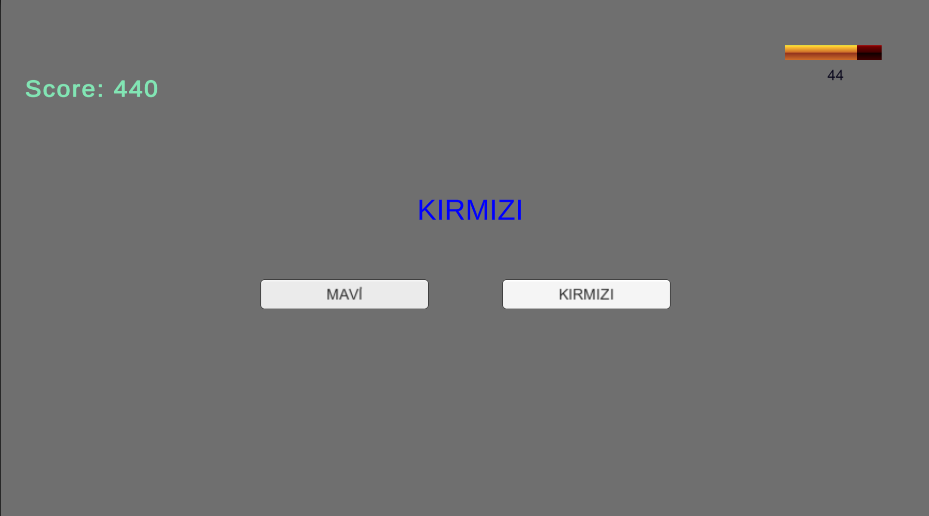
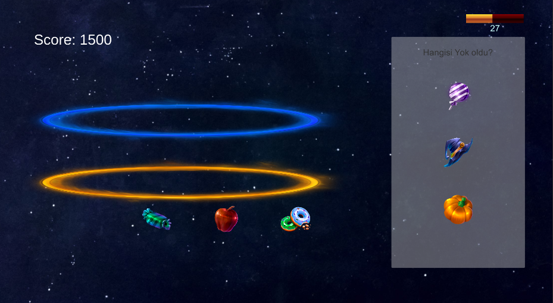
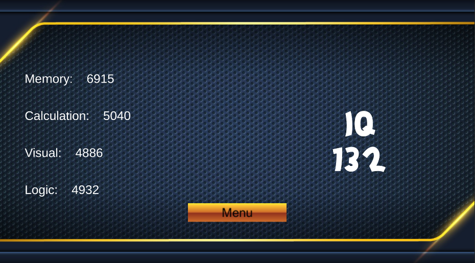

This game, which I developed as my graduation project, includes multiple mini-games, each falling under specific categories: memory, calculation, visual, and logic. In each game, you earn points in the corresponding category based on the skills you demonstrate. At the end of the game, it provides you with an IQ score, reflecting your overall performance across these diverse challenges.

The incorporation of various mini-games not only adds variety to the gameplay but also assesses different cognitive skills, making it an engaging and comprehensive experience. It serves as an excellent platform for users to challenge and improve their memory, calculation, visual, and logical reasoning abilities, ultimately contributing to a more accurate representation of their cognitive prowess through the final IQ score.
## In-Game Screenshots

